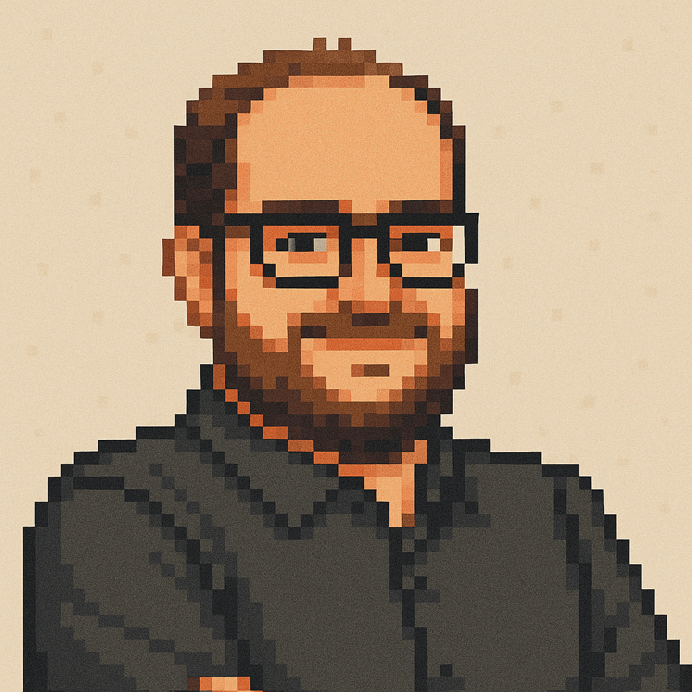

<div align="center">
  

  # Felipe Iasi

  **Full Stack Developer & Product Innovator**

  [](https://felipeiasi.com)
  [](https://www.linkedin.com/in/felipe-iasi)
  [](https://github.com/ficosta)
</div>

## About

Personal portfolio website showcasing my work as a Full Stack Developer and Product Innovator. 14+ years of experience in development, broadcast media, and product leadership.

## Tech Stack

- React 19 + TypeScript
- Vite
- Tailwind CSS v4
- Framer Motion
- OKLCH color space

## Features

- Three theme modes (Light, Dark, Surprise)
- Fully responsive
- SEO optimized
- PWA support
- Custom cursor
- Smooth animations

## Installation

```bash
git clone https://github.com/ficosta/felipe-portfolio.git
cd felipe-portfolio
npm install
npm run dev
```

## Build

```bash
npm run build
npm run preview
```

## Project Structure

```
src/
├── components/       # Reusable components
├── sections/         # Page sections
├── lib/              # Utilities
├── types/            # TypeScript types
└── data/             # Content (site.json)
```

## Theme System

### Light Mode
Notebook-inspired design with ruled lines and margin

### Dark Mode (default)
Clean dark interface

### Surprise Mode
8 creative themes: Doom 64, Monochrome, Neo-Brutalism, Notebook, Bubblegum, Vaporwave, Forest Depths, Cyber Tokyo

## License

Open source - available for reference

---

© 2025 Felipe Iasi | Built with React & Tailwind CSS
